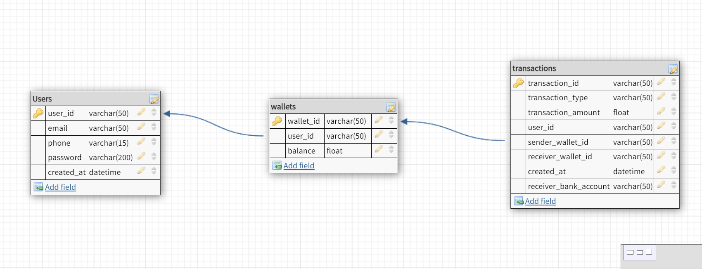

MINI-LENDING SERVICE GUIDE

Service contains 2 branches: 

 - Master branch contains full project
 - transactional branch implements transaction management for creating a transaction on a wallet 

=================== Functionalities: ====================

1. Can Create & Authenticate User

2. can Create single wallet per user

3. can Create transactions for a user that has a wallet

=================== Project Startup: ===================

1. After pulling, install dependencies with npm install.  
    P.S: Install typescipt as dev dependency, mine is installed globally

2. Create mySql DB and add credentials to .env, check out .env.example file for guidance. 
    PS: I've added an exported mySQL DB as an SQL file if you wish to import locally. 
    If you wish to create your own DB, check design in 'Database Design' section below

3. Build project by running "npm run build"

4. Start project by running "npm start". Project runs on port 5000. Check out 'Postman APIs' 
    section below to access endpoints

====================== Database Design: ===========================

====================== Postman APIs: ===========================

1. Via Run in Postman  ======>  []
    (https://app.getpostman.com/run-collection/3f6bfa337229f8cca49b?action=collection%2Fimport)

2. Via JSON link  =====>  https://www.getpostman.com/collections/3f6bfa337229f8cca49b